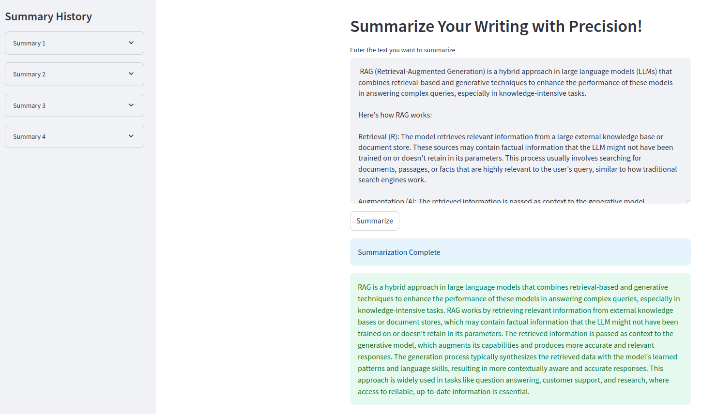

# Text Summarizer

The **Text Summarizer** app is a streamlined tool built using advanced natural language processing (NLP) techniques. By leveraging state-of-the-art Transformer models, it condenses large pieces of text into concise summaries. This application is designed to help users quickly process and comprehend lengthy documents, saving time and improving information intake.

## Features

- **Text Summarization**: Condense large blocks of text into shorter, more digestible summaries.
- **User-Friendly Interface**: Easy-to-use interface built with Streamlit for seamless interaction.
- **History Tracking**: Stores and displays previously summarized text for easy reference.
- **Customizable Summary Length**: The app offers flexibility in summary length (minimum and maximum).

## Skills & Technologies

The project utilizes the following skills and technologies:

- **Natural Language Processing (NLP)**
- **Large Language Models (LLM)**
- **Python** (for implementation)
- **Transformers** (for text processing using models like T5)
- **Streamlit** (for creating the user interface)
- **Text Processing & Tokenization**

## Requirements

To run this project locally, ensure you have the following Python packages installed:

- `transformers`
- `torch`
- `streamlit`

You can install the dependencies using the following:

```bash
pip install transformers torch streamlit
```

## How to Run

1. Clone the repository to your local machine:

    ```bash
    git clone https://github.com/Taha533/Text-Summarizer.git
    ```

2. Run the Streamlit app:

    ```bash
    streamlit run app.py
    ```

3. Open the URL provided by Streamlit in your browser to access the app.


## How It Works

1. **Model and Tokenizer**: The app uses the `LaMini-Flan-T5-248M` model from the Hugging Face model hub for text summarization. The tokenizer and model are loaded at the start.
2. **Text Summarization**: When the user enters text, the app generates a summary using the T5 model, which condenses the input text based on the parameters defined in the summarization pipeline.
3. **Streamlit Interface**: The Streamlit interface allows users to input text, get summaries, and view previous summaries stored in the session history.

## Screenshots

 


---
